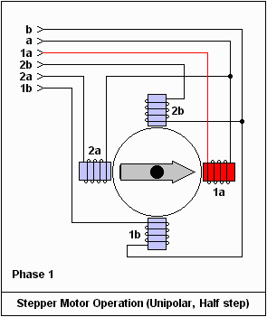
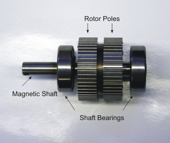
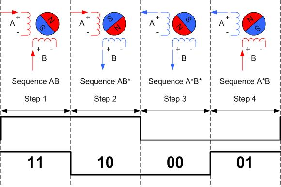
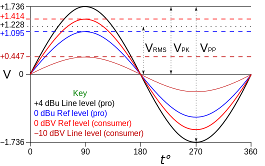
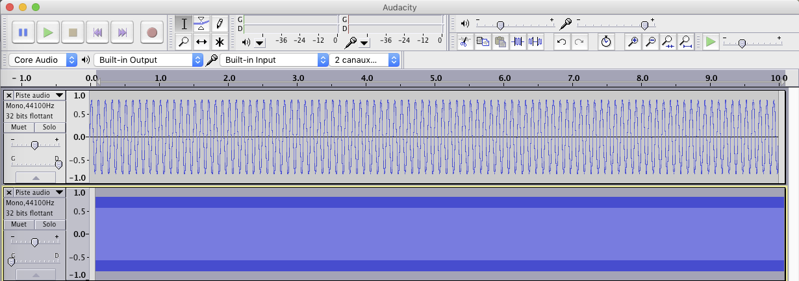

#Rapport CSE

##Sommaire
1. Principe
2. Technique
	* Moteur pas-à-pas
	* Sortie Audio
	* Principe general du montage
3. Montage
	* Choix des composants
	* Schema
4. Realisation
5. Conclusion

##Principe

L'idée general de ce projet est de fournir une interface aisée de contrôle des moteurs pas-à-pas. Ces moteurs sont souvent utilisés dans les machines de controle numérique type CNC. A l'origine le port parallèle permettait de commander ces moteurs avec les nombreux signaux synchronisé necessaire. Par la suite, quand ces port parallèles sont devenus moins courant, des puces FTDI permettant de controller des cartes de controle sont devenus l'outil de choix. 

Ces moteurs, en raison de leur bas cout, de leur fort couple et de leur utilisation facile, sont devenu un composant de base dans la communauté des makers. On les retrouve notamment dans des projets tels que la shapeoko, l'eggbot ou meme la RepRap . Neammoins, l'interface classique reste compliquée pour le neophyte (a savoir mettre en place une connection serial), coute cher (FTDI et microcontrolleur) et necessite une connection constante à un ordinateur dédié. 

Ce que nous proposons est de pouvoir controller des moteurs pas-à-pas directement avec la sortie son d'un ordinateur. Les avantages sont nombreux:

* Simplicité d'usage
* Possibilité d'avoir un generateur de signal directement dans le naviguateur web
* Bas prix de la carte de controle car réalisée uniquement à partir de composant analogiques
* Possibilité de controller le moteur depuis un lecteur MP3 ou un smartphone

##Technique
Les deux blocs techniques de ce projets sont les suivant

###Moteurs pas-à-pas
Les moteurs pas-à-pas fonctionnent sur un principe assez simples mais ne sont devenu commun qu'avec les methodes récentes de fabrication d'aimant. Le principe, par exemple avec les moteurs bipolaires qui sont les plus courant et d'energiser de manière successive deux bobines pour faire "sauter" une roue crantée d'un pas. 

Ce schema montre le fonctionnement simplifié en supposant 4 pas par révolutions, et dans le cas du Half-stepping. Dans la pratique le coeur du moteur est composé d'une roue aimanté crantée ce qui permet d'avoir un nombre de pas par révolution arbitraire. 

Ce nombre de pas par révolution est néanmoins normalisé par la norme Nema, avec 200 ou 400 pas par révolution pour la plupart des moteurs. 

La séquence de controle des moteurs est donc la suivante:

Il est cependant à noter que la plupart des drivers de moteurs pas-à-pas utilisent une interface Dir/Step beaucoup plus pratique.

###Sortie audio

La plupart des equipements electroniques intégrent aujourd'hui une sortie audio. Il existe une norme de sortie de signal, appelé line level mais qui n'est par forcement implémenté dans les cartes sons habituelle. La raison principale est que ces sorties sont souvent utilisé avec des ecouteurs qui necessitent plus de puissance. De plus le voltage normalisé dépend de l'impédance d'entrée ce qui complique encore le problème. 

 
En general, le niveau line est normalisé pour de l'equipement utilisateur à 0.894V pic-à-pic. Cependant, nos test sur les sorties ecouteurs de différents devices ont montré un pic-à-pic habituel de 3Volts, pouvant varier.
Il est à supposer que cet écart à la norme est du aux conditions general d'usage de ces sorties (écouteurs).

Il est en tout cas sur qu'il est important de concevoir un système robuste aux variation de voltage de pic en entrée.

###Principe général du montage

L'idée general du montage est d'utiliser les deux canaux droites et gauche d'une sortie audio pour diriger un driver Dir/Step de moteur pas-à-pas. Chaque entrée audio arrive sur un amplificateur non inverseur qui permet de transformer la sinuoide en signal crénaux. Un de ces signaux (haute fréquence) passe par un detecteur de crète pour fournir la direction puis par un suiveur, et l'autre (basse fréquence) passe par un suiveur pour generer les pas. L'interet de ce montage est d'etre robuste au voltage d'entrée et donc de permettre une utilisation aisée du système quel que soit le device utilisé. 

##Montage

###Choix des composants

On choisi d'utiliser:

* Un moteur Nema 14 200 pas/rev
* Des AO Texas instrument 

	Cet AO à l'interet d'avoir une unique alimentation 5v, ce qui permet à notre montage de fonctionner sur une alimentation classique
	
* Un driver de moteur pas-a-pas A4988

###Schema

##Realisation
On choisi de réaliser le montage précédant sur une breadboard. L'entrée Jack est relié à un ordinateur est on utilise Audacity pour generer les sinusoide necessaire à fréquénce 10hz et 10khz. 

La vidéo suivante montre le système en fonctionnement. 
<embed type="video/quicktime" src="CSE video.m4v" width="420" height="240">

Malheureusement, les 3 drivers dont nous disposions ont brulé en raison d'une alimentation fautive (ou peut d'etre d'une erreur à regler le potentiomètre de limitation de courant, qui sait).

##Conclusion
En conlusion, ce projet permet de montrer la possibilité d'utiliser des sorties audio pour controller des moteurs pas-à-pas. Les cas d'usage d'un tel système sont nombreux, et il pourrait etre réalisé à bas cout voir intégré dans les moteurs eux-memes. Il reste neammoins de nombreuses améliorations possibles, parmis lequels:

 * Ecrire une interface de controle dans le browser
 * Ajouter un support pour les servomoteurs
 * Ajouter un support multimoteurs
 
 
 
*2016- Melchior Merlin , Benjamin Poilvé*
